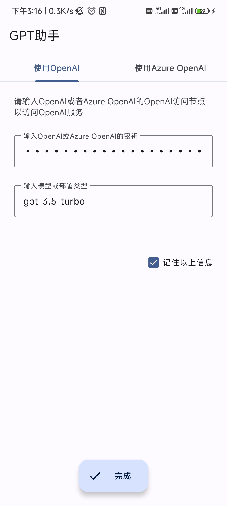
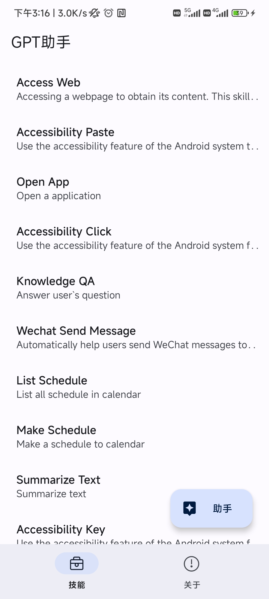
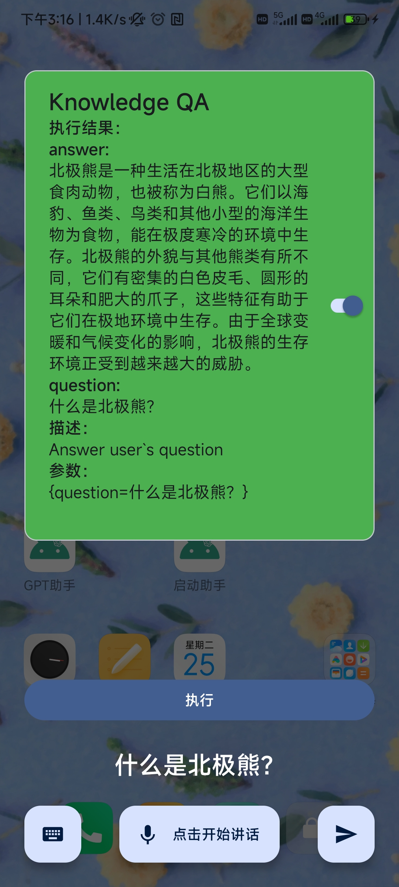

# GPT助手：让GPT来操作你的手机！

GPT助手是一款将GPT融入Android设备操作的软件。与其他手机助手一致，你可以通过语音输入一段指令，GPT助手即可去执行相应的任务。

<a href="./README_en.md">Readme in English</a>

## 🖼️截图

#   

## 😎功能演示

https://user-images.githubusercontent.com/47859250/234208243-a1c783d3-191c-4f3b-a1ee-e9c07068b8d9.mp4

https://user-images.githubusercontent.com/47859250/234208820-2487735a-b7e9-426a-bad9-aa8f4ab32571.mp4

https://user-images.githubusercontent.com/47859250/234209152-2575232f-7541-4c79-83ab-b7829f7e352a.mp4

https://user-images.githubusercontent.com/47859250/234209197-0447a516-bc1f-424e-a6cb-25b82647ef8f.mp4

https://user-images.githubusercontent.com/47859250/234209451-2b1a29d2-47cf-440e-8844-92d9390754af.mp4

## ✅目前支持的功能

- 打开应用程序

- 给指定联系人发送微信

- 制定/查看指定日期的日程

- 访问网页

- 总结文章内容

- 知识问答

    在未来，GPT助手将会支持更多功能，因为GPT助手的扩展非常容易。

## 🎈快速开始

- 你可以通过Github releases来下载最新的GPT助手安装包。

- 你需要拥有[OpenAI](https://openai.com/)或者[Azure OpenAI](https://azure.microsoft.com/zh-cn/products/cognitive-services/openai-service/)的访问权限以访问GPT服务。如果想要使用语音输入功能，你还需要拥有[Azure Speech Service](https://speech.microsoft.com/)的访问权限。你可以点击相应链接了解更多信息。

- 将GPT助手安装到你的Android设备上，根据提示输入OpenAI或者Azure OpenAI的相关信息、Azure Speech Service的相关信息。

- 进入到主界面，点击右下角的“助手”按钮或者在手机桌面上点击“启动助手”图标，即可启动GPT助手功能！

## 😊感谢以下人员和开源项目

- 本项目由 [@zhangyin-github](https://github.com/zhangyin-github) 监督

- The Android Open Source Project

- [Jetpack](https://developer.android.google.com/jetpack)

- [OpenAI-Java:](https://github.com/TheoKanning/openai-java) OpenAI GPT-3 Api Client in Java

- [Gson:](https://github.com/google/gson) A Java serialization/deserialization library to convert Java Objects into JSON and back

- [okhttp:](https://github.com/square/okhttp) Square’s meticulous HTTP client for the JVM, Android, and GraalVM

- [Jsoup:](https://github.com/jhy/jsoup) The Java HTML parser, built for HTML editing, cleaning, scraping, and XSS safety

- [PermissionX:](https://github.com/guolindev/PermissionX) An open source Android library that makes handling runtime permissions extremely easy

## 许可证

GPT助手 根据GNU通用公共许可证v3（GPL-3）（http://www.gnu.org/copyleft/gpl.html）进行许可。